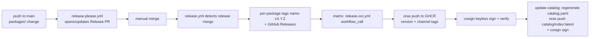

# Catalog release process

Per-package versioning and publishing for the Inari catalog. Packages ship as
independently-versioned, cosign-signed OCI artifacts on the `stable` and
`incubating` channels.

> **Status:** the `packages/<name>/` layout, channels, and the `catalog.yaml`
> index landed in M2-W1 with five golden-path packages (see README). The
> release automation below is fully wired for that layout; `release.yml` also
> regenerates and commits `catalog.yaml` after each publish **and pushes it
> as the OCI index artifact** `ghcr.io/7k-inari/catalog/index:latest` (the ref
> inari-server's `INARI_CATALOG_OCI_INDEX_REF` consumes).

## Flow



1. **`release-please.yml`** (`on: push` to `main`, PR-only mode,
   `skip-github-release: true`): regenerates the manifest config from
   `packages/` via `scripts/sync-release-please-config.py`, then opens/updates
   a single Release PR with per-package version bumps and CHANGELOG entries.
2. **Manual merge** of the Release PR.
3. **`release.yml`** (`on: push` to `main`) detects the release merge by
   commit message (`chore: release ...`), diffs `packages/*/package.yaml` to
   find bumped packages, creates tags `<name>-vX.Y.Z` and GitHub Releases with
   the package's changelog section, then fans out a matrix of OCI publish
   jobs.
4. **`release-oci.yml`** (`workflow_call` only — there are deliberately **no
   tag-push triggers** anywhere): pushes the package directory to
   `ghcr.io/7k-inari/catalog/<name>:<version>` plus the channel tag via oras,
   cosign-signs keylessly (GitHub OIDC), and verifies the signature.
5. **`update-catalog` job** (in `release.yml`, after all package publishes):
   regenerates `catalog.yaml` via `scripts/build-catalog-index.py`, commits
   it back to `main`, and pushes it as the **catalog index artifact**
   `ghcr.io/7k-inari/catalog/index:latest` (oras file push — the layer title
   is `catalog.yaml`, exactly what inari-server's `RegistryPuller` looks up —
   plus a dated tag for traceability), cosign-signed keylessly. Point
   inari-server's `INARI_CATALOG_OCI_INDEX_REF` at the `:latest` ref.

### Registry auth for consumers

inari-server pulls the index and package artifacts with go-containerregistry's
`authn.DefaultKeychain`. The `ghcr.io/7k-inari/catalog/*` packages are
**public**, so an anonymous GHCR token suffices and no docker config is
needed in the pod. If the packages ever become private, mount a
dockerconfigjson with a `read:packages` token into the inari-server pod and
set `DOCKER_CONFIG` to its directory.

## Adding a package (M2-W1 contract)

Each package directory must contain `packages/<name>/package.yaml`:

```yaml
version: 0.1.0        # SemVer; bumped by release-please (extra-files)
channel: incubating   # stable | incubating; default incubating if absent
```

`sync-release-please-config.py` picks up every `packages/<name>/` with a
`package.yaml` automatically — no manual edits to
`release-please-config.json` are needed (`release-please.yml` commits the
regenerated config back to `main`, since the action reads config from the
repository, not the job's working tree). The `validate.yml` workflow (a
required status check) enforces this structure and will gain KRO/CEL
type-checks, `helm lint`, and OPA/Rego tests in M2-W1.

## Conventions

- **Conventional Commits are required** — release-please derives bumps from
  them (`feat:` minor, `fix:` patch, `feat!:`/`BREAKING CHANGE` major).
- Versions are pre-major aware: `feat:` bumps minor, breaking changes bump
  minor until 1.0.0 (`bump-minor-pre-major`).
- One Release PR aggregates all pending package bumps; merging it releases
  every bumped package independently.

## Required secrets / settings

- `RELEASE_PLEASE_TOKEN`: GitHub App token (contents + pull-requests write).
  Release PRs opened with the default `GITHUB_TOKEN` do **not** fire `push`
  events when merged, so `release.yml` would never run without this. Fallback:
  if org policy forbids apps, use a PAT, or manually dispatch `release.yml`.
- Branch protection on `main`: require the `validate / packages` check.

## Channel promotion

`channel: stable` vs `incubating` in `package.yaml` controls only which
channel tag the OCI artifact receives. Promote a package by PRing the channel
change; promotion takes effect on the next release of that package.
