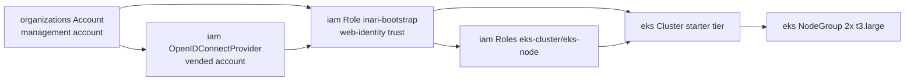

# tenant-zone-aws

Tenant Zone Factory for AWS (platform plan §5.12): one governed, auditable
request turns "new tenant" into a vended AWS account with a bootstrapped EKS
starter cluster. Executed on the **platform cluster**; driven by the M3-W2
Tenant Zone Factory (`inari-operator` handles the Inari-side wiring:
Keycloak Organization, Cluster/CloudAccount records, registration token,
baseline GitOps bundle).

## Flow (long-running steps tracked as sub-resources)

1. **Account vend** — `organizations.aws.upbound.io/Account` in the target OU
   via the management-account ProviderConfig; mandatory cost tags
   (`inari.dev/cost-center`, `inari.dev/zone`, `inari.dev/environment`).
   Auto-creates `OrganizationAccountAccessRole` in the new account.
2. **Trust bootstrap** — `iam/OpenIDConnectProvider` for the platform
   cluster's OIDC issuer plus the `<zone>-inari-bootstrap` role with the same
   web-identity contract as BYO onboarding (§5.7): `AssumeRoleWithWebIdentity`
   conditioned on `aud = sts.amazonaws.com`. No stored keys anywhere.
3. **Cluster provision (starter tier)** — EKS cluster + minimal managed node
   group (default 2× t3.large) with least-privilege cluster/node roles.

`status.state` walks `VendingAccount → BootstrappingTrust →
ProvisioningCluster → Active` from resource readiness; the flow is resumable
and idempotent because kro reconciles the MRs and AWS-side async operations
are tracked via MR status conditions.

## Prerequisites

- Platform cluster with Crossplane providers: `provider-aws-organizations`,
  `provider-aws-iam`, `provider-aws-eks`.
- A management-account `CloudAccount` (`scope: management`) whose role allows
  `organizations:CreateAccount/TagResource/DescribeCreateAccountStatus`
  (least privilege, nothing else) → `managementProviderConfigName`.
- A per-tenant ProviderConfig (`tenantProviderConfigName`) that role-chains
  through `OrganizationAccountAccessRole` into the vended account — created
  by `inari-operator` once the account exists (v1 uses the
  `OrganizationAccountAccessRole` chain; a dedicated vended-account role is a
  follow-up).
- Org-side guardrails for the vended account ship as the separate
  `org-guardrails-aws` package (CloudTrail, budget alert).

## Parameters

| Name | Type | Default | Description |
|---|---|---|---|
| `zoneName` | string | — (required) | Zone name/slug (account, cluster names). |
| `email` | string | — (required) | Root email for the vended account. |
| `ouId` | string | — (required) | Target Organizational Unit ID. |
| `region` | string | `eu-west-1` | Single starter region. |
| `tier` | string | `starter` | Cluster tier (v1: `starter` only). |
| `managementProviderConfigName` | string | — (required) | Management-account ProviderConfig. |
| `tenantProviderConfigName` | string | — (required) | Vended-account ProviderConfig (role-chained). |
| `platformOidcProviderArn` | string | — (required) | Platform cluster IAM OIDC provider ARN. |
| `platformOidcIssuer` | string | — (required) | Platform cluster OIDC issuer hostpath. |
| `costCenter` | string | — (required) | Mandatory cost tag. |
| `environment` | string | `production` | Environment tag. |
| `subnetIds` | []string | `[]` | VPC subnets for EKS. |
| `nodeInstanceType` | string | `t3.large` | Node instance type. |
| `nodeCount` | integer | `2` | Desired/min node count (max = +1). |
| `kubernetesVersion` | string | `1.31` | EKS version. |

## Status

`accountId`, `clusterName`, `state`, `ready`.

## Decommission

Reverse of the flow (behind approval gates, §5.11): cordon → drain
Inari-managed resources → delete the EKS resources → `CloseAccount`/suspend →
revoke identities. Ownership-checked by the Tenant Zone Factory.

## Validation

- **CI (mocked):** `tests/run.sh` runs on kind + kro with stub
  organizations/iam/eks CRDs; asserts the RGD goes `Active`, the full graph
  renders, ProviderConfig wiring, and mandatory cost tags.
- kro validation of the graph (CEL type-check) is exercised by the same test.
